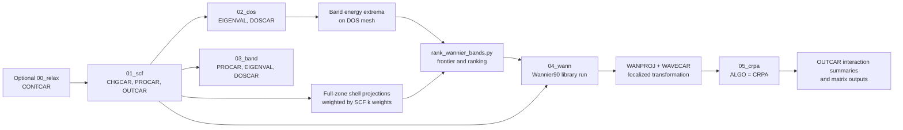

# Version 1 VASP SCF-to-cRPA Operation Manual

**Audience:** VASP researchers using Bash, Slurm, VASPKIT, and Wannier90  
**Source snapshot:** `version1`, reviewed 2026-07-28  
**Scope:** Six production scripts and the active `workflow.conf`

This manual describes what the `version1` workflow actually does. It distinguishes
scripted defaults from researcher decisions and does not treat automatic parameter
generation as a substitute for physical validation or convergence testing.

## Contents

- [Part I - SCF-to-cRPA Physics and Calculation Process](#part-i---scf-to-crpa-physics-and-calculation-process)
  - [1. Physical objective](#1-physical-objective)
  - [2. End-to-end data flow](#2-end-to-end-data-flow)
  - [3. Stage-by-stage process](#3-stage-by-stage-process)
  - [4. Exact automated choices](#4-exact-automated-choices)
  - [5. Researcher quality gates](#5-researcher-quality-gates)
  - [6. Version-sensitive cautions](#6-version-sensitive-cautions)
- [Part II - Detailed Runtime Script and Configuration Manual](#part-ii---detailed-runtime-script-and-configuration-manual)
  - [7. Requirements and operating model](#7-requirements-and-operating-model)
  - [8. Single-case quick start](#8-single-case-quick-start)
  - [9. workflow.sh command reference](#9-workflowsh-command-reference)
  - [10. batch_workflow.sh](#10-batch_workflowsh)
  - [11. postprocess.py](#11-postprocesspy)
  - [12. rank_wannier_bands.py](#12-rank_wannier_bandspy)
  - [13. prepare_wannier.py](#13-prepare_wannierpy)
  - [14. prepare_crpa.py](#14-prepare_crpapy)
  - [15. workflow.conf](#15-workflowconf)
  - [16. Troubleshooting](#16-troubleshooting)
  - [17. Primary references](#17-primary-references)

# Part I - SCF-to-cRPA Physics and Calculation Process

## 1. Physical objective

The constrained random-phase approximation (cRPA) supplies effective Coulomb
interactions for a low-energy model. The workflow first represents the chosen
low-energy subspace in a Wannier basis. It then evaluates a partially screened
interaction after excluding screening processes attributed to selected target
Wannier states.

In schematic form, split the independent-particle polarizability into target and
rest contributions:

$$
P(\omega) = P_{\mathrm{target}}(\omega) + P_{\mathrm{rest}}(\omega).
$$

The constrained screened interaction is then formed from the bare Coulomb kernel
$v$ and the remaining polarizability:

$$
W_{\mathrm{rest}}(\omega) =
\left[1 - vP_{\mathrm{rest}}(\omega)\right]^{-1}v.
$$

Matrix elements of $W_{\mathrm{rest}}$ in the chosen Wannier basis define the
frequency-dependent interaction tensor and its commonly reported averages,
including Hubbard $U$ and Hund exchange $J$. This physical interpretation
and the distinction between target and rest screening follow the
[VASP cRPA formalism](https://vasp.at/wiki/CRPA_formalism).

The target space is a scientific choice. A successful job is not evidence that
the orbital projections, energy windows, target-state indices, or convergence
parameters are physically appropriate.

## 2. End-to-end data flow



The base `submit` command creates only the optional relaxation, SCF, DOS, and
band Slurm chain. Wannier and cRPA are prepared and submitted later, after their
required upstream results have been inspected.

## 3. Stage-by-stage process

### 3.1 Optional `00_relax`: establish the structure

**Physical role.** Optimize ionic positions and, with the active `ISIF=3`,
the cell degrees of freedom.

**Input.** Root `POSCAR` and `POTCAR`, plus the generated relaxation `INCAR`.

**Output used downstream.** `CONTCAR`.

**Transfer rule.** Immediately before `01_scf` runs, `workflow.sh` copies
`00_relax/CONTCAR` to `01_scf/POSCAR`.

**Quality gate.**

- Confirm ionic and electronic convergence, sensible forces and stress, and the
  absence of unphysical structural changes.
- For fixed experimental cells, slabs, or constrained geometries, review
  `ISIF`, selective dynamics, and whether relaxation should be skipped.

The active `workflow.conf` sets `RUN_RELAX=no`, so a plain `prepare` currently
starts from `01_scf`. Use relaxation only after changing that setting or invoking
the workflow in a configuration that enables it.

### 3.2 `01_scf`: converge the ground-state charge density

**Physical role.** Obtain the self-consistent Kohn-Sham charge density used by
all non-self-consistent downstream stages.

**Important generated settings.**

- `LCHARG = .TRUE.` writes `CHGCAR`.
- `LWAVE = .TRUE.` requests `WAVECAR`.
- `LORBIT = 10` writes projection information needed by later analysis.
- `KPOINTS` is a Gamma-centered mesh generated by VASPKIT task 102, option 2,
  using `KPR_SCF=0.04`.

**Outputs consumed later.**

- `CHGCAR` is copied to `02_dos`, `03_band`, and `04_wann`.
- `POSCAR` is copied to those same stages.
- `POTCAR` is also copied to `04_wann`.
- `OUTCAR` supplies the final effective `NBANDS` value used to size the
  Wannier calculation.
- `PROCAR` supplies site/shell projection weights and irreducible-k-point
  integration weights used to rank Wannier target bands. VASP documents these
  fields in its [PROCAR reference](https://vasp.at/wiki/PROCAR); with
  `LORBIT=10`, the values are qualitative PAW-projector weights as described in
  the [LORBIT reference](https://vasp.at/wiki/LORBIT).

**Quality gate.**

- Confirm electronic convergence and inspect the final energy, Fermi level,
  occupations, magnetization, and any DFT+U or spin-orbit behavior.
- Verify that `NBANDS`, k-point density, pseudopotentials, functional, magnetism,
  and symmetry choices match the intended cRPA study.
- Do not rely only on `workflow.sh status`; it detects a normal VASP timing
  footer, not scientific convergence.

### 3.3 `02_dos`: characterize energies on a uniform mesh

**Physical role.** Perform a non-self-consistent calculation using the SCF
charge density (`ICHARG=11`) on the denser DOS mesh.

**Important generated settings.**

- `ISMEAR=-5` uses the tetrahedron method.
- VASPKIT generates the Gamma-centered mesh using `KPR_DOS=0.03`, and
  `NEDOS=2000` is the active energy-grid default.
- `LORBIT=10` makes element/orbital DOS extraction possible.

**Outputs used by this workflow.**

- `EIGENVAL` supplies the minimum and maximum energy of each ranked band over
  the DOS k-mesh.
- `DOSCAR` is used by VASPKIT task 113 and by postprocessing.

**Quality gate.**

- Check that the mesh and smearing are appropriate for the dimensionality and
  metallic character.
- Inspect the orbital-resolved DOS around the intended target manifold.
- Confirm that DOS `EIGENVAL` and SCF `PROCAR` contain the same band count and
  spin layout; preparation validates both before joining their band indices.

### 3.4 `03_band`: identify orbital character along a symmetry path

**Physical role.** Evaluate non-self-consistent bands along a line-mode path
generated by VASPKIT task 303.

**Important generated settings.**

- `ICHARG=11` reuses the SCF charge density.
- `KPOINTS` is copied from the root `KPATH.in`.
- `LORBIT=10` enables `PROCAR` projections.

**Outputs used for plotting.**

- VASPKIT task 213 converts `INCAR`, `POSCAR`, `DOSCAR`, `EIGENVAL`,
  `KPOINTS`, and `PROCAR` into element files named `PBAND_<element>.dat`
  and a `KLABELS` file.
- These PBAND files are used by projected-band/DOS plotting. Wannier ranking
  instead reads the uniform-mesh `01_scf/PROCAR` directly.

VASPKIT documents task 213 as projected band structure by element and task 113
as projected DOS by element in its
[feature list](https://vaspkit.com/features.html) and
[tutorials](https://vaspkit.com/tutorials.html).

**Quality gate.**

- Confirm that the path is appropriate for the actual cell used in the SCF
  calculation.
- Inspect crossings and hybridization. A target described as "d bands" may need
  additional ligand or itinerant orbitals for a faithful Wannier subspace.
- Compare the element- and orbital-resolved plot before choosing
  `--elements` and `--orbitals`; override the inferred `--num-bands` when the
  desired subspace differs from the projection-based default.

### 3.5 Projection ranking: define a frontier, not an explicit band list

For each spin channel, the ranking score for band $n$ is the normalized
Brillouin-zone projection

$$
S_{n\sigma} =
\frac{\sum_{\mathbf{k}} \omega_{\mathbf{k}}
\sum_{i \in \mathcal{I}} \sum_{l \in \mathcal{L}}
P_{n\mathbf{k}\sigma}^{i,l}}
{\sum_{\mathbf{k}} \omega_{\mathbf{k}}}.
$$

Here, $\omega_{\mathbf{k}}$ is the integration weight written in SCF PROCAR,
$\mathcal{I}$ contains all ions of the requested elements, and $\mathcal{L}$
contains the requested aggregate `s`, `p`, `d`, or `f` shells. Bands are ordered
by decreasing $S_{n\sigma}$. Equal scores are ordered by ascending
band index. For a non-spin calculation, the top `--num-bands` entries are
joined to the same band indices in `02_dos/EIGENVAL`. For a collinear-spin
calculation, the UP and DW SCF PROCAR blocks are ranked independently, so the two
channels may select different band-index sets.

The combined frontier is the smallest and largest DOS-mesh energy among each
channel's selected bands. `prepare_wannier.py` saves only those per-channel
selections in `04_wann/wannier_band_ranking.csv`.

If a channel's selected indices are noncontiguous, they are partitioned into
maximal contiguous runs. The run containing the most selected indices drives
that channel's Wannier windows. Equal-length runs are resolved in favor of the
run containing the highest-ranked band. This window choice does not remove
other selected bands, reduce `NUM_WANN`, or change the combined frontier.

> **Important distinction:** `--elements Mn Sb --orbitals d p` creates the
> positionally paired Wannier projections `Mn:d` and `Sb:p`, but the ranking
> score sums both `d` and `p` over all Mn and Sb ions. The selected
> band indices are used to calculate the energy frontier; they are not written
> to Wannier90 as `exclude_bands`.

### 3.6 `04_wann`: construct the Wannier transformation

**Physical role.** Run the VASP-Wannier90 interface on a uniform Gamma-centered
k-mesh, guided by projections and automatically generated disentanglement
windows.

**Preparation inputs.**

- `01_scf`: non-empty `INCAR`, `POSCAR`, `POTCAR`, `CHGCAR`, `OUTCAR`, and
  shell-resolved `PROCAR`.
- `02_dos`: non-empty `EIGENVAL`.

**Preparation actions.**

1. Rank the requested orbital character.
2. Read the last effective `NBANDS =` value from `01_scf/OUTCAR`.
3. Set Wannier `NBANDS` to twice that value.
4. Generate a Wannier90 k-point path with VASPKIT task 304, option 3.
5. Generate a uniform Gamma-centered `KPOINTS` mesh with VASPKIT task 102,
   option 2, using `KPR_WANN` (default `0.04`) or the `--kpr` override.
6. Clone unrelated SCF INCAR settings and replace the controlled Wannier tags.

**Controlled Wannier settings.**

```text
ICHARG = 11
ISYM = -1
NBANDS = 2 * effective SCF NBANDS
LWRITE_WANPROJ = .TRUE.
LWANNIER90_RUN = .TRUE.
NUM_WANN = --num-bands, or the inferred projection count when omitted
write_hr = true
num_iter = 0
dis_num_iter = 1000
bands_plot = true
bands_num_points = 20
```

`LWANNIER90_RUN` asks VASP to run Wannier90 in library mode. VASP must be
compiled and linked with the appropriate VASP2WANNIER90 support; see the
[VASP Wannier construction guide](https://vasp.at/wiki/Constructing_Wannier_orbitals)
and [`LWANNIER90_RUN`](https://vasp.at/wiki/LWANNIER90_RUN).

`LWRITE_WANPROJ` writes the Wannier transformation matrices used by cRPA.
When `WANPROJ` is present, VASP can read that transformation rather than repeat
Wannierization; see the [WANPROJ specification](https://vasp.at/wiki/WANPROJ).

> **Localization note:** the shipped block uses `num_iter=0`. It performs up to
> 1000 disentanglement iterations but no subsequent Wannier spread-minimization
> iterations. If maximally localized functions are required, that setting is a
> researcher-controlled modification that must be validated.

**Quality gate.**

- Review `wannier_band_ranking.csv`, including the frontier and selected band
  indices.
- Compare original DFT bands with the Wannier-interpolated bands throughout the
  energy range relevant to the model.
- Check the orbital ordering and character of every Wannier state before using
  one-based indices in `NTARGET_STATES`.
- Confirm that `WANPROJ` and `WAVECAR` are non-empty after the run.
- Inspect Wannier90 convergence messages and, if localization is enabled,
  centers and spreads.

### 3.7 `05_crpa`: exclude target screening and obtain interactions

`prepare_crpa.py` accepts only a completed, workflow-owned `04_wann`. It requires
non-empty `POSCAR`, `POTCAR`, `KPOINTS`, `CHGCAR`, `WAVECAR`, `WANPROJ`,
`INCAR`, and `OUTCAR`. The OUTCAR must contain VASP's normal completion marker.
`WAVEDER` is copied only when present and non-empty.

The generated INCAR activates:

```text
ALGO = CRPA
NTARGET_STATES = <one-based Wannier state indices>
NBANDS = <effective completed-Wannier NBANDS>
NBANDSGW = <default NBANDS, or --nbandsgw>
ENCUTGW = <default 2/3 ENCUT, or --encutgw>
ISYM = -1
LMAXMIX = 6
KPAR = <CRPA_KPAR>
```

`NTARGET_STATES` identifies Wannier states whose screening contributions are
excluded. The ordering is basis-dependent, so the indices must be chosen from
the inspected Wannier basis, not guessed from chemical labels. See
[`NTARGET_STATES`](https://vasp.at/wiki/NTARGET_STATES).

The default `ENCUTGW=2/3 ENCUT` follows the VASP response-function default, but
it remains a convergence parameter. Increasing `ENCUTGW` alone is not a complete
basis-convergence strategy; see [`ENCUTGW`](https://vasp.at/wiki/ENCUTGW).
Likewise, high accuracy generally requires `NBANDSGW` to approach `NBANDS`, at
substantial cost; see [`NBANDSGW`](https://vasp.at/wiki/NBANDSGW).

**Reading results.**

- Search `05_crpa/OUTCAR` for screened interaction blocks such as
  `U_iijj`, `U_ijji`, and `U_ijij`.
- Record the averaged screened Hubbard `U`, inter-orbital `u`, and Hund `J`
  reported for the desired frequency.
- Inspect the bare interaction blocks as a screening sanity check.
- Preserve full interaction-matrix outputs such as `UIJKL` and `VIJKL` when
  produced by the installed VASP version and selected options.
- Treat symmetry, Hermiticity, orbital equivalence, frequency dependence, and
  convergence as scientific checks rather than parser output.

The [VASP SrVO3 cRPA example](https://vasp.at/wiki/CRPA_of_SrVO3) illustrates
the OUTCAR summaries and full matrix outputs.

## 4. Exact automated choices

### 4.1 Plane-wave cutoff

When `ENCUT=auto`, the workflow reads every `ENMAX` value from the root
`POTCAR`, takes the largest, multiplies it by `ENCUT_FACTOR=1.30`, and rounds
up to the next 5 eV:

$$
\mathrm{ENCUT}
=
\operatorname{ceil}_{5\,\mathrm{eV}}
\left(1.30 \max_i \mathrm{ENMAX}_i\right).
$$

An explicit `ENCUT` in `workflow.conf` bypasses this calculation. An existing
root `POTCAR` is reused; `prepare --force` does not regenerate it.

### 4.2 Disentanglement windows

For each spin channel, partition the rank-ordered target-band indices into
maximal contiguous runs and choose the run with the most indices. If runs have
the same length, choose the one containing the highest-ranked band. Let
$E_{\min}$ and $E_{\max}$ be the union envelope of these independently chosen
UP/DW window bands in `02_dos/EIGENVAL`. For each channel, find the highest
energy among bands below its chosen run and the lowest energy among bands above
it. Let $G_{\mathrm{lower}}$ be the larger of the available lower guards and
$G_{\mathrm{upper}}$ the smaller of the available upper guards. A missing guard
at an EIGENVAL edge leaves that side unbounded.

| Window | Lower bound | Upper bound |
|---|---:|---:|
| Outer (`dis_win`) | $E_{\min}-5.0$ eV | $E_{\max}+5.0$ eV |
| Frozen candidate | $\max(E_{\min},G_{\mathrm{lower}})$ | $\min(E_{\max},G_{\mathrm{upper}})$ |
| Frozen (`dis_froz`) | candidate minimum + `--frozen-margin` | candidate maximum - `--frozen-margin` |

The margin defaults to 0.1 eV. Preparation fails if the shrunken interval is
empty, contains a band outside the chosen run, or contains more than
`NUM_WANN` states at any EIGENVAL k-point in either spin channel. Selected
ranked bands outside the chosen run remain in the ranking CSV and count toward
`NUM_WANN`, but are outside the window-driving target block. In Wannier90, the
outer window provides candidate states while the frozen manifold is retained
in the optimized subspace; the parameters are documented in the
[Wannier90 parameter reference](https://www.wannier.org/ford/module/w90_parameters.html).

### 4.3 Band counts

- SCF `NBANDS` is chosen by VASP unless the templates are changed.
- Wannier `NBANDS` is exactly twice the last effective SCF OUTCAR value.
- `NUM_WANN` is the requested `--num-bands`, or by default the sum of each
  paired element's atom count times its orbital multiplicity.
- `NUM_WANN` must not exceed the doubled SCF `NBANDS`.
- cRPA `NBANDS` is the last effective value from completed `04_wann/OUTCAR`.
- cRPA `NBANDSGW` defaults to that value and may not exceed it.

### 4.4 Stage ownership and refresh semantics

Generated stage directories contain `.generated-by-poscar-workflow`.
`workflow.sh` refuses to overwrite a stage lacking that marker.

For `00_relax` through `03_band`, `prepare --force` refreshes generated inputs
in place. It does not delete old `OUTCAR`, `WAVECAR`, `CHGCAR`, or scheduler
logs. Archive or remove stale outputs deliberately before rerunning.

For `04_wann` and `05_crpa`, the Python preparers build a complete temporary
stage and replace only an existing workflow-owned stage when `--force` is used.

## 5. Researcher quality gates

### 5.1 Before SCF

- Confirm POSCAR species order, cell, constraints, dimensionality, and magnetic
  initialization.
- Confirm POTCAR choices, including semicore or GW variants where appropriate.
- Set the functional, DFT+U, magnetism, SOC, smearing, and symmetry consistently.
- Converge `ENCUT` and k-point density for the desired observables.

### 5.2 Before Wannier preparation

- Verify that SCF, DOS, and band runs used compatible structures, potentials,
  spin treatment, and band indexing.
- Plot projected bands and DOS.
- Choose a basis large enough to reproduce hybridized target bands.
- Use `rank_wannier_bands.py` interactively to inspect several candidate
  `--num-bands` choices instead of accepting one ranking blindly.
- Check that the automatic frozen and outer windows contain the intended
  manifold at every k-point.

### 5.3 Before cRPA preparation

- Compare DFT and Wannier-interpolated bands.
- Identify the one-based ordering of target Wannier states.
- Decide whether all Wannier states or only a subset belong to the correlated
  model.
- Preserve the completed `04_wann` inputs and outputs used to generate
  `05_crpa`.

### 5.4 cRPA convergence program

At minimum, test sensitivity to:

- Uniform Wannier/cRPA k-mesh (`--kpr`).
- SCF and Wannier `NBANDS`, including empty states.
- `NBANDSGW`.
- `ENCUT` and `ENCUTGW` together.
- Projection set, `NUM_WANN`, and disentanglement windows.
- Presence and treatment of `WAVEDER`.
- Smearing, spin/SOC, symmetry, and the cRPA method available in the installed
  VASP version.

Report the VASP version, pseudopotentials, target basis, target-state indices,
all convergence parameters, and whether quoted values are static or
frequency-dependent.

## 6. Version-sensitive cautions

### 6.1 Default projector cRPA versus spectral cRPA

The supplied `INCAR_CRPA_TEMPLATE` sets `ALGO=CRPA` and does not set `LSCRPA`;
therefore it uses VASP's default projector-cRPA path. Current VASP 6.6
documentation recommends spectral cRPA for new calculations. The active
`SBATCH_TEMPLATE`, however, sources an environment named `vasp651_env.sh`.
Do not add VASP 6.6-only guidance to a VASP 6.5.1 job without checking
compatibility and reproducing validation.

### 6.2 `WAVEDER` is conditional, not automatically beneficial

`prepare_crpa.py` copies `WAVEDER` if it exists and otherwise emits a warning
while still preparing the stage. Current VASP documentation notes a
projector-cRPA long-wave caveat for which deleting `WAVEDER` may improve
k-point convergence in affected cases. Other cRPA methods can have different
recommendations. Treat the file as a method- and version-dependent scientific
choice.

### 6.3 Script completion is not physical validation

The automation validates files, indices, layouts, and ownership. It does not
validate:

- whether target orbitals are localized enough;
- whether the target space reproduces the DFT bands;
- whether the automatic energy windows are optimal;
- whether the interaction is converged;
- whether the chosen cRPA method is suitable for the installed VASP version.

# Part II - Detailed Runtime Script and Configuration Manual

## 7. Requirements and operating model

### 7.1 Software

| Component | Requirement and use |
|---|---|
| Bash | Bash 4+ is required for arrays, associative arrays, and strict mode. |
| VASP | A VASP 6 build appropriate for `ALGO=CRPA`; the Wannier stage also requires VASP2WANNIER90 support and a linked Wannier90 library. |
| Wannier90 | Used through VASP library mode by `LWANNIER90_RUN=.TRUE.`. |
| VASPKIT | Generates POTCAR, line paths, uniform KPOINTS, projected bands, projected DOS, and the Wannier90 path. |
| Python | Python 3.10+ for union type syntax and the four Python scripts. |
| NumPy/Matplotlib | Required by `postprocess.py`; the other Python utilities use the standard library. |
| Slurm | Required for `submit`, `submit-wannier`, and `submit-crpa`; not required for a correctly configured direct `run`. |
| Unix utilities | `awk`, `sed`, `grep`, `find`, `sort`, `cmp`, `mktemp`, and standard file utilities. |

VASPKIT must be configured with a licensed local pseudopotential library before
task 103 can build `POTCAR`. Do not publish licensed POTCAR content or large
calculation outputs unintentionally.

### 7.2 Script-location rule

`workflow.sh`, `prepare_wannier.py`, and `prepare_crpa.py` treat the directory
containing the script as the workflow root by default. Running
`/path/case/workflow.sh` while standing elsewhere still operates on
`/path/case`.

`rank_wannier_bands.py` uses `01_scf` and sibling `02_dos` relative to the
current working directory by default. Use explicit paths when calling it
outside a case root.

### 7.3 Production files

| File | Role |
|---|---|
| `workflow.sh` | Main single-case stage generator, runner, submitter, status tool, and wrapper. |
| `batch_workflow.sh` | Creates and operates isolated cases for multiple POSCAR files. |
| `postprocess.py` | Produces combined projected-band/projected-DOS figures. |
| `rank_wannier_bands.py` | Ranks orbital-character bands and reports DOS-mesh energy ranges. |
| `prepare_wannier.py` | Builds the workflow-owned `04_wann` stage. |
| `prepare_crpa.py` | Builds the workflow-owned `05_crpa` stage. |
| `workflow.conf` | Active site, Slurm, calculation, command, and template configuration. |

### 7.4 Stage directories and markers

| Stage | Purpose | Key upstream dependency |
|---|---|---|
| `00_relax` | Optional structural relaxation | Root POSCAR/POTCAR |
| `01_scf` | Self-consistent ground state | Root POSCAR or `00_relax/CONTCAR` |
| `02_dos` | Non-self-consistent DOS | `01_scf/CHGCAR` |
| `03_band` | Non-self-consistent symmetry-path bands | `01_scf/CHGCAR` and `KPATH.in` |
| `04_wann` | Wannier target-space construction | Completed SCF/DOS/band data |
| `05_crpa` | Constrained RPA | Completed workflow-owned `04_wann` |

`.workflow-stages` records enabled stages. Each generated stage also contains
`.generated-by-poscar-workflow`.

## 8. Single-case quick start

### 8.1 Create an isolated case

Copy the runtime files into a dedicated calculation directory rather than
placing material data in the master script source:

```bash
mkdir -p my_material
cp /path/to/version1/{workflow.sh,workflow.conf,batch_workflow.sh,postprocess.py,rank_wannier_bands.py,prepare_wannier.py,prepare_crpa.py} my_material/
cp /path/to/POSCAR my_material/POSCAR
cd my_material
chmod +x workflow.sh batch_workflow.sh
```

Review `workflow.conf` before preparing. It is already present and will be
sourced automatically.

### 8.2 Prepare and submit SCF, DOS, and bands

The active configuration has `RUN_RELAX=no`:

```bash
./workflow.sh prepare
./workflow.sh status
./workflow.sh submit --job-name Pu
```

The optional prefix produces `Pu-relax`, `Pu-scf`, `Pu-dos`, and `Pu-band`.
The equivalent `--job-name=Pu` form is also accepted. If the option is omitted,
the names stored in each generated `job.sh` remain unchanged.

To enable relaxation, change `RUN_RELAX=yes` in `workflow.conf`. Conversely,
`prepare --no-relax` always disables relaxation for that preparation.

After jobs finish:

```bash
./workflow.sh status
grep -n "General timing and accounting" 01_scf/OUTCAR 02_dos/OUTCAR 03_band/OUTCAR
```

Inspect scientific convergence before continuing.

### 8.3 Plot projected bands and DOS

Element-resolved example:

```bash
./workflow.sh postprocess --elements Mn Sb --emin -5 --emax 5 --title "My material"
```

Orbital-resolved example:

```bash
./workflow.sh postprocess --orbital-element Mn --orbitals dxy dyz dz2 dxz dx2-y2
```

The default outputs are `projected_band_dos.png` and
`projected_band_dos.pdf` in the case root.

### 8.4 Inspect candidate band rankings

```bash
python3 rank_wannier_bands.py \
  --scf-directory 01_scf \
  --dos-directory 02_dos \
  --elements Mn Sb \
  --orbitals d p \
  --num-bands 22 \
  --csv candidate_ranking.csv
```

Review the selected band indices, BZ-weighted projections, energy extrema, and total
frontier.

### 8.5 Prepare and run Wannier

```bash
./workflow.sh prepare-wannier \
  --elements Mn Sb \
  --orbitals d p \
  --kpr 0.04

./workflow.sh submit-wannier --job-name Pu
```

Wait for `04_wann` to finish. Then inspect:

- `04_wann/OUTCAR`;
- `04_wann/wannier_band_ranking.csv`;
- DFT versus Wannier-interpolated bands;
- Wannier state ordering and orbital character;
- non-empty `04_wann/WANPROJ` and `04_wann/WAVECAR`.

### 8.6 Prepare and run cRPA

By default, every Wannier state from 1 through `NUM_WANN` is selected:

```bash
./workflow.sh prepare-crpa
./workflow.sh submit-crpa --job-name Pu
```

Mixed indices and ranges are allowed:

```bash
./workflow.sh prepare-crpa \
  --target-states 1-5 8 10-12 \
  --nbandsgw 160 \
  --encutgw 400
```

Wait for completion, then inspect `05_crpa/OUTCAR` and full interaction files.
`submit-crpa` does not add a Slurm dependency on the Wannier job; preparation
itself requires the Wannier run to be complete.

## 9. `workflow.sh` command reference

### 9.1 General behavior

```text
./workflow.sh COMMAND [OPTIONS]
```

At startup, the script:

1. sets strict Bash mode;
2. resolves its own directory as `ROOT_DIR`;
3. sources `${WORKFLOW_CONFIG}` or `ROOT_DIR/workflow.conf` when present;
4. applies fallback defaults for values not supplied by configuration;
5. dispatches one command.

Set `WORKFLOW_CONFIG=/absolute/path/to/alternate.conf` to use a different
configuration file.

### 9.2 Command summary

| Command | Purpose | Important options |
|---|---|---|
| `prepare` | Generate base stage inputs from root POSCAR/POTCAR. | `--force`, `--no-relax` |
| `run` | Execute enabled `00_relax` through `03_band` sequentially. | None |
| `submit` | Submit the base Slurm dependency graph. | `--job-name PREFIX` |
| `execute STAGE` | Run one prepared stage directly for testing or manual operation. | Stage name |
| `status` | Report prepared/started/finished from marker and OUTCAR state. | None |
| `postprocess [ARGS]` | Run `postprocess.py` with the workflow root. | All postprocess flags |
| `prepare-wannier` | Build `04_wann`. | `--elements`, `--orbitals`, `--num-bands`, `--kpr`, `--frozen-margin`, `--force` |
| `run-wannier` | Execute prepared `04_wann` directly. | None |
| `submit-wannier` | Submit only `04_wann/job.sh`. | `--job-name PREFIX` |
| `prepare-crpa` | Build `05_crpa`. | `--target-states`, `--nbandsgw`, `--encutgw`, `--force` |
| `run-crpa` | Execute prepared `05_crpa` directly. | None |
| `submit-crpa` | Submit only `05_crpa/job.sh`. | `--job-name PREFIX` |

### 9.3 `prepare [--force] [--no-relax]`

**Input validation.**

- Root `POSCAR` must exist and be non-empty.
- POSCAR line 6 must contain element symbols; VASP 4-style files are rejected.
- POSCAR line 7 must contain atom counts.

**POTCAR behavior.**

- A non-empty root `POTCAR` is reused.
- Otherwise VASPKIT task 103 runs in a temporary directory.
- Failure to locate VASPKIT or generate POTCAR stops preparation.

**Band-path behavior.**

- If `GENERATE_BANDS` is not `yes`, `03_band` is omitted.
- A non-empty root `KPATH.in` is reused.
- Otherwise VASPKIT task 303 attempts to create it.
- If task 303 or VASPKIT is unavailable, preparation continues with DOS but no
  band stage.

**Prepared stages.**

- Current active default: `01_scf 02_dos 03_band`.
- With relaxation enabled: `00_relax 01_scf 02_dos 03_band`.
- If band generation fails: omit `03_band`.

**`--force`.**

- Permits refreshing an existing workflow-owned base stage.
- Never permits overwriting an unowned stage directory.
- Does not delete old outputs.
- Does not regenerate an existing root POTCAR or KPATH.in.

**`--no-relax`.** Overrides `RUN_RELAX` and starts directly from the supplied
POSCAR.

### 9.4 `run`

Runs enabled base stages in fixed order:

```text
00_relax -> 01_scf -> 02_dos -> 03_band
```

DOS and band are executed sequentially in direct mode even though they are
independent after SCF.

The active default command is:

```bash
mpirun -np "$SLURM_NTASKS" vasp_std
```

Therefore direct mode must run inside an allocation that defines
`SLURM_NTASKS`, or `STAGE_COMMANDS` must be changed for the workstation or
interactive environment. The VASP environment source line in the active
`SBATCH_TEMPLATE` is used by submitted jobs, not by a plain direct run.

### 9.5 `submit`

Requires `SUBMIT_COMMAND` (active default `sbatch`) and a prepared `01_scf`.

The dependency graph is:

```text
00_relax --afterok--> 01_scf --afterok--> 02_dos
                              \
                               --afterok--> 03_band
```

DOS and band are independent children of SCF. Slurm job IDs are parsed from
`sbatch --parsable` output. Invalid job-ID output stops submission. Each
submission runs from its target stage directory, so relative Slurm output and
error paths are created there.

Every generated stage job is self-contained. It can also be submitted without
the wrapper:

```bash
cd 02_dos
sbatch job.sh
```

Manual downstream submissions require completed predecessor outputs or an
explicit scheduler dependency.

### 9.6 `execute STAGE`

This direct-execution entry point verifies the stage marker, synchronizes
predecessor files, selects
`STAGE_COMMANDS[STAGE]` or `STAGE_COMMANDS[default]`, prepends
`EXECUTION_SETUP`, and runs the result through `bash -lc` in the stage
directory.

Do not normally call `execute` manually unless testing a prepared stage.

### 9.7 Stage synchronization rules

| Destination | Synchronized immediately before execution |
|---|---|
| `01_scf` | If relaxation is enabled, copy `00_relax/CONTCAR` to `01_scf/POSCAR`. |
| `02_dos` | Copy `01_scf/POSCAR` and `01_scf/CHGCAR`. |
| `03_band` | Copy `01_scf/POSCAR` and `01_scf/CHGCAR`. |
| `04_wann` | Copy `01_scf/POSCAR`, `CHGCAR`, and `POTCAR`. |
| `05_crpa` | No runtime synchronization; it uses the snapshot made by `prepare-crpa`. |

Missing required predecessor files stop execution. Generated jobs implement
the same synchronization rules using paths relative to their own stage
directory; they do not invoke or source the parent `workflow.sh` or
`workflow.conf`.

### 9.8 `status`

For each enabled stage:

- `prepared`: no non-empty OUTCAR;
- `started`: non-empty OUTCAR without the normal VASP timing footer;
- `finished`: OUTCAR contains `General timing and accounting informations for this job`.

`started` can mean running, stopped, or failed. `finished` means normal VASP
termination, not necessarily acceptable physical convergence.

### 9.9 `postprocess [ARGS]`

Executes:

```text
PYTHON_BIN postprocess.py --root ROOT_DIR [ARGS]
```

See Section 11 for the complete Python interface.

### 9.10 Wannier wrapper commands

`prepare-wannier` injects the configured Wannier resolution:

```text
--root ROOT_DIR --vaspkit VASPKIT_BIN --kpr KPR_WANN
```

After successful preparation, it writes `04_wann/job.sh`, registers the stage,
and instructs the operator to use `run-wannier` or `submit-wannier`.

`run-wannier` executes only `04_wann`.

`submit-wannier` submits only `04_wann/job.sh` with no upstream Slurm
dependency. It parses a numeric job ID from `--parsable` output. The job may
also be submitted directly from `04_wann` after its SCF prerequisites exist.

### 9.11 cRPA wrapper commands

`prepare-crpa` injects:

```text
--root ROOT_DIR --kpar CRPA_KPAR
```

It also passes `INCAR_CRPA_TEMPLATE` through the environment. After successful
preparation, it writes a cRPA-resource-specific `05_crpa/job.sh` and registers
the stage.

`run-crpa` executes only `05_crpa`.

`submit-crpa` submits only `05_crpa/job.sh` and adds no dependency. The job may
also be submitted directly from `05_crpa` after preparation.

## 10. `batch_workflow.sh`

### 10.1 Purpose and syntax

```text
./batch_workflow.sh [OPTIONS] STRUCTURE_DIR [CALCULATION_DIR]
```

It discovers structures, creates one isolated calculation directory per input,
copies the top-level runtime files, runs `workflow.sh prepare`, and optionally
runs or submits the base workflow.

### 10.2 Options

| Option | Meaning | Default |
|---|---|---|
| `--mode prepare\|submit\|run` | Stop after preparation, submit each case, or execute each case directly. | `submit` |
| `--no-relax` | Pass `--no-relax` to each preparation. | Off |
| `--force` | Refresh existing batch-owned cases. | Off |
| `--dry-run` | Print discovered mappings without creating or changing files. | Off |
| `-h`, `--help` | Show usage. | - |

If `CALCULATION_DIR` is omitted, it becomes a `calculations` directory next to
`STRUCTURE_DIR`.

### 10.3 Discovered inputs

The recursive search accepts:

- files named `POSCAR`;
- files named `POSCAR*`;
- case-insensitive `*.vasp`;
- case-insensitive `*.poscar`.

The calculation output directory is pruned from discovery when it lies below
the structure tree.

### 10.4 Case naming

- `STRUCTURE_DIR/Fe/POSCAR` becomes `Fe`.
- Nested path separators become `__`.
- For other files, the extension and leading `POSCAR`, `_`, or `-` are removed.
- Characters outside `A-Z`, `a-z`, `0-9`, `.`, `_`, and `-` become `_`.
- Duplicate derived names abort the batch before any changes.

Always run `--dry-run` first:

```bash
./batch_workflow.sh --dry-run structures calculations
```

### 10.5 Files copied to each case

All top-level regular files from the script directory are copied except:

- `batch_workflow.sh`;
- `POSCAR`;
- `POTCAR`;
- `KPATH.in`;
- `.workflow-stages`.

This includes `workflow.sh`, `workflow.conf`, and the Python runtime scripts.
Subdirectories are not copied.

### 10.6 Ownership and refresh behavior

Batch-created cases contain `.batch-workflow-case`.

- An existing non-directory destination is reported as failed.
- An existing directory without the marker is never modified.
- An existing batch-owned case is skipped unless `--force` is supplied.
- If an existing case POSCAR differs from the discovered source POSCAR, the
  case is refused even with `--force`; use a new calculation directory.

With `--force`, runtime files are recopied and `workflow.sh prepare --force`
runs. Base-stage outputs may remain, as described in Section 4.4.

### 10.7 Failure handling and exit status

The batch continues after per-case preparation, run, or submission failures.
It prints:

```text
Batch summary: prepared=N completed=N skipped=N failed=N
```

The script exits nonzero when any case failed. Skipped existing cases do not
alone cause failure.

### 10.8 Direct-run caution

`--mode run` inherits the copied `workflow.conf`. With the active command map,
it requires `SLURM_NTASKS` and a loaded VASP environment. For workstation use,
customize the copied command and environment settings before running the batch.

## 11. `postprocess.py`

### 11.1 Purpose

Generate one publication-oriented figure combining projected bands from
`03_band` with projected DOS from `02_dos`.

By default, it runs:

- VASPKIT task 213 in `03_band`;
- VASPKIT task 113 in `02_dos`.

Use `--reuse-data` to skip VASPKIT and use existing `PBAND_*.dat`,
`PDOS_*.dat`, and `KLABELS`.

### 11.2 Required files

For task 213 in `03_band`:

```text
INCAR POSCAR DOSCAR EIGENVAL KPOINTS PROCAR
```

For task 113 in `02_dos`:

```text
INCAR POSCAR DOSCAR
```

After extraction, matching `PBAND_<element>.dat` and
`PDOS_<element>.dat` files are required. For spin-polarized calculations,
the matching `PBAND_<element>_UP.dat`/`PBAND_<element>_DW.dat` and
`PDOS_<element>_UP.dat`/`PDOS_<element>_DW.dat` pairs are recognized
automatically. Both files in each pair are required. `PBAND_SUM`,
`PBAND_USER`, `PDOS_SUM`, and `PDOS_USER` (including spin-suffixed variants)
are excluded from automatic element discovery.

### 11.3 Complete CLI

| Option | Meaning | Default |
|---|---|---|
| `--root PATH` | Workflow root. | Script directory |
| `-o`, `--output STEM` | Output path without extension; relative paths resolve under root. | `projected_band_dos` |
| `--format png\|pdf\|svg` | Output format; repeat for multiple formats. | PNG and PDF |
| `--emin EV` | Minimum plotted energy. | `-5.0` |
| `--emax EV` | Maximum plotted energy. | `5.0` |
| `--dos-max VALUE` | DOS-axis magnitude; auto-scaled if omitted. | Auto |
| `--marker-scale VALUE` | Projected-band marker-area scale. | `35.0` |
| `--elements E...` | Plot selected elements. | All matching elements |
| `--orbital-element E` | Switch to orbital-resolved mode for one element. | Off |
| `--orbitals O...` | Orbital columns in orbital mode. | All common matching columns |
| `--title TEXT` | Optional figure title. | None |
| `--dpi N` | PNG resolution. | `600` |
| `--reuse-data` | Reuse existing VASPKIT output. | Off |
| `--wannier-bands` | Overlay Fermi-aligned bands from completed `04_wann`. | Off |
| `--vaspkit COMMAND` | VASPKIT executable/command string. | `VASPKIT_BIN` or `vaspkit` |

Validation rejects:

- `emin >= emax`;
- non-positive `dos-max`, `marker-scale`, or `dpi`;
- `--orbitals` without `--orbital-element`;
- combining `--orbital-element` and `--elements`.

### 11.4 Element-resolved mode

Each element uses:

- total PBAND weight, or the sum of orbital columns when no total column exists;
- total element DOS;
- one color in both panels.

The script verifies that all PBAND files use the same row count, k-path, and
energy grid.

### 11.5 Orbital-resolved mode

Only one element is selected. Named columns are matched between its PBAND and
PDOS files after case/punctuation normalization.

- Requested shell labels such as `s`, `p`, `d`, and `f` are used when present.
- Component labels such as `dxy` or `dz2` may be selected explicitly.
- The selected element's total DOS is always plotted in addition to orbital
  traces.

### 11.6 Spin and energy conventions

- Spin-up DOS is plotted on the positive horizontal axis.
- Spin-down DOS is reflected onto the negative horizontal axis and drawn with
  a dashed line.
- The energy axis is labeled $E-E_F$. VASPKIT normally shifts the Fermi
  energy to zero; verify its local configuration and generated data.

With `--wannier-bands`, the projected DFT bands and markers remain visible and
the Wannier-interpolated curves are added in a high-contrast color. The option
requires a completed `04_wann` with a readable `INCAR`, `OUTCAR`, and:

- `wannier90_band.dat` for effective `ISPIN=1` (including VASP's default when
  `ISPIN` is omitted);
- both `wannier90.1_band.dat` and `wannier90.2_band.dat` for `ISPIN=2`.

The final `E-fermi` value in `04_wann/OUTCAR` is subtracted from the raw
Wannier90 energies. Wannier k-distance is mapped to the DFT panel's k-path
domain. For `ISPIN=2`, spin up is solid and spin down is dashed. Missing spin
files, malformed or inconsistent band blocks, unsupported `ISPIN`, and absent
Fermi data stop plotting with an error.

For example:

```bash
./workflow.sh postprocess --wannier-bands --reuse-data --emin -4 --emax 4
```

### 11.7 Outputs

The default figure is 5.3 x 3.8 inches with a band:DOS width ratio of 2.25:1.
PNG uses the requested DPI. PDF embeds TrueType-compatible fonts; SVG keeps
text as text. Existing output files are overwritten by Matplotlib.

## 12. `rank_wannier_bands.py`

### 12.1 Purpose

Rank band indices from full-zone SCF PROCAR shell projections using VASP's
k-point integration weights. Join those indices to DOS-stage EIGENVAL energies
and report per-band extrema, bandwidths, and a combined frontier.

### 12.2 Complete CLI

| Option | Meaning | Default |
|---|---|---|
| `--scf-directory PATH` | Directory containing `POSCAR` and `PROCAR`. | `01_scf` relative to current directory |
| `--elements E...` | POSCAR elements whose ions are combined. | Required |
| `--orbitals O...` | Aggregate `s`, `p`, `d`, or `f` shells to sum. | Required |
| `--num-bands N` | Keep only the N highest-projection bands. | All |
| `--csv PATH` | Write a machine-readable copy. | None |
| `--dos-directory PATH` | Directory containing EIGENVAL. | Sibling `02_dos` of resolved SCF directory |

### 12.3 PROCAR and POSCAR validation

The SCF PROCAR must contain:

- one positive k-point/band/ion layout declaration;
- exactly `NKPTS` non-spin blocks or `2*NKPTS` collinear-spin blocks;
- sequential k-point and band indices;
- one consistent shell-only `ion s p d [f] tot` table per state;
- finite projections and finite, nonnegative k-point weights with positive sum.

POSCAR must use VASP 5 element labels and its atom count must equal PROCAR's ion
count. DOS EIGENVAL must match PROCAR's band count and spin channels.

### 12.4 Orbital resolution

Shell matching is case-insensitive. Only unique aggregate `s`, `p`, `d`, and
`f` requests are accepted. Component names such as `dxy` are rejected because
the generated SCF calculation uses shell-resolved `LORBIT=10`.

### 12.5 Ranking and spin handling

For each band, requested shell projections are summed over every ion belonging
to every requested element. Each irreducible-k-point contribution is multiplied
by its PROCAR `weight =` value, and the result is divided by the total k-point
weight. Requested element/orbital lists use cross-product semantics for ranking,
while Wannier projection specifications remain positionally paired. Ties use
the lower band index.

EIGENVAL may contain:

- three-column non-spin rows, emitted with spin label `none`;
- five-column collinear-spin rows, emitted as adjacent `up` and `down` results.

Noncollinear or unexpected EIGENVAL layouts are not supported by this parser.

### 12.6 Table and CSV fields

The text table includes rank, band, spin, BZ-weighted projection, SCF NKPTS,
k-point-weight sum, DOS NKPTS, minimum, maximum, and bandwidth.

CSV columns are:

```text
rank
band_index
spin
bz_weighted_projection
scf_n_kpoints
kpoint_weight_sum
dos_n_kpoints
min_value
max_value
bandwidth
total_frontier_min_value
total_frontier_max_value
total_frontier_width
```

## 13. `prepare_wannier.py`

### 13.1 Normal and direct use

Normal wrapper, selecting all `1..NUM_WANN` states by default:

```bash
./workflow.sh prepare-wannier \
  --elements Mn Sb \
  --orbitals d p
```

Direct CLI:

```bash
python3 prepare_wannier.py \
  --root /path/to/case \
  --elements Mn Sb \
  --orbitals d p \
  --num-bands 22 \
  --kpr 0.04 \
  --frozen-margin 0.1 \
  --vaspkit vaspkit \
  --force
```

### 13.2 Complete CLI

| Option | Meaning | Default |
|---|---|---|
| `--root PATH` | Workflow root. | Script directory |
| `--elements E...` | Projection elements, paired by position with orbitals. | Required |
| `--orbitals O...` | Projection orbitals and ranking orbital requests. | Required |
| `--num-bands N` | Number of top-ranked bands and `NUM_WANN`; overrides inference. | Inferred from POSCAR and projections |
| `--kpr VALUE` | VASPKIT reciprocal resolution for Gamma mesh. | `0.04` |
| `--frozen-margin EV` | Inward margin applied to both isolated frozen-window bounds. | `0.1` |
| `--vaspkit COMMAND` | VASPKIT command string. | `VASPKIT_BIN` or `vaspkit` |
| `--force` | Replace an existing workflow-owned `04_wann`. | Off |

Elements and orbitals must contain the same number of non-empty, single-token
values. The projection list is positionally paired. When `--num-bands` is
omitted, the default is the sum of each matching `01_scf/POSCAR` atom count
times the paired orbital multiplicity: `s=1`, `p=3`, `d=5`, and `f=7`.
Other orbital names are rejected even when `--num-bands` is explicit, because
ranking is intentionally restricted to `LORBIT=10` aggregate shells. Spin
polarization does not double the inferred value.

### 13.3 Required upstream files

```text
01_scf/INCAR
01_scf/POSCAR
01_scf/POTCAR
01_scf/CHGCAR
01_scf/OUTCAR
01_scf/PROCAR
02_dos/EIGENVAL
```

Preparation parses shell projections and k-point integration weights directly
from `01_scf/PROCAR`. It does not fall back to `02_dos/PROCAR`, symmetry-line
PBAND data, or equal-k averaging. If SCF PROCAR is missing, rerun or restart the
SCF projection output with `LORBIT=10` before preparation.

For a spin-polarized calculation, target bands are ranked independently from
the UP and DW PROCAR blocks and may have different band indices. Each channel
must select exactly the resolved `NUM_WANN` count. A noncontiguous selection is
reduced to its largest contiguous run only for window calculation; equal-length
runs prefer the one containing the highest-ranked band.

The common frozen-window candidate is the intersection of two intervals: the
union of the chosen UP/DW run energy envelopes, and the interval between the
largest top-of-below-run energy and smallest bottom-of-above-run energy from
either channel. `--frozen-margin` then shrinks both candidate bounds. The outer
window is the chosen-run envelope union extended by 5 eV on each side.
Validation checks the final window against each channel's chosen run.

### 13.4 Generated VASPKIT data

- Task 304, option 3: `KPATH.wannier90`, from which exactly one complete
  `begin kpoint_path` block is extracted.
- Task 102, option 2: uniform Gamma-centered `KPOINTS` at the requested KPR.

The generated Wannier path is not copied from the existing `03_band/KPATH.in`.

### 13.5 INCAR inheritance

The SCF INCAR is cloned, but the following controlled assignments are removed
before new Wannier values are appended:

```text
SYSTEM KSPACING KGAMMA NBANDS ICHARG ISYM
LWRITE_WANPROJ LWANNIER90_RUN NUM_WANN WANNIER90_WIN
```

Other settings, including functional, spin, DFT+U, and precision choices, are
preserved. Review inherited settings for suitability on the new uniform mesh.

### 13.6 Generated `04_wann`

```text
POSCAR
POTCAR
CHGCAR
KPOINTS
INCAR
wannier_band_ranking.csv
.generated-by-poscar-workflow
job.sh                  # added by workflow.sh wrapper
```

VASP/Wannier90 is expected to add `OUTCAR`, `WAVECAR`, `WANPROJ`, Hamiltonian
and band-interpolation outputs, and other run products.

### 13.7 Safe replacement

The preparer builds a temporary complete directory under the workflow root.
An existing `04_wann`:

- is refused if it lacks the workflow marker;
- is refused without `--force`;
- is fully replaced when it is owned and `--force` is supplied.

## 14. `prepare_crpa.py`

### 14.1 Normal and direct use

Normal wrapper:

```bash
./workflow.sh prepare-crpa
```

Direct CLI:

```bash
python3 prepare_crpa.py \
  --root /path/to/case \
  --target-states 1-5 8 10-12 \
  --nbandsgw 160 \
  --encutgw 400 \
  --kpar 4 \
  --force
```

### 14.2 Complete CLI

| Option | Meaning | Default |
|---|---|---|
| `--root PATH` | Workflow root. | Script directory |
| `--target-states I_OR_RANGE...` | Unique one-based indices or inclusive ascending ranges. | `1` through `NUM_WANN` |
| `--nbandsgw N` | QP/response band count. | Effective completed-Wannier NBANDS |
| `--encutgw EV` | Response-function cutoff. | `2/3 * ENCUT` |
| `--kpar N` | cRPA k-point parallelization. | `CRPA_KPAR` or `1` |
| `--force` | Replace an existing workflow-owned `05_crpa`. | Off |

Ranges such as `1-5` expand in input order. Descending ranges, zero, duplicates,
and indices larger than `NUM_WANN` are rejected.

### 14.3 Completion and input requirements

`04_wann` must contain the workflow marker and:

```text
POSCAR POTCAR KPOINTS CHGCAR WAVECAR WANPROJ INCAR OUTCAR
```

OUTCAR must contain the VASP completion marker. The final effective OUTCAR
`NBANDS` is authoritative. The preparer reads `NUM_WANN`, `ENCUT`, and `EDIFF`
from the last effective scalar assignments in `04_wann/INCAR`. It also reads
the effective `ISPIN` (defaulting to 1), validates it against the `WANPROJ`
header, and requires the header's Wannier-orbital count `NW` to equal
`NUM_WANN`.

### 14.4 Resolved settings

- `NBANDS`: completed Wannier OUTCAR value.
- `NBANDSGW`: override or `NBANDS`; must be positive and no greater than
  `NBANDS`.
- `ENCUTGW`: override or two-thirds of Wannier `ENCUT`.
- Effective completed-Wannier `ISPIN` is checked against `WANPROJ`. It is not
  inserted into the cRPA template automatically.
- `NTARGET_STATES`: expanded validated indices, preserving order.
- `KPAR`: positive wrapper/configuration value.

### 14.5 `WAVEDER`

A non-empty `04_wann/WAVEDER` is copied. Its absence prints a warning but does
not fail preparation. Apply the method/version caution from Section 6.2.

### 14.6 Generated `05_crpa`

The preparer copies:

```text
POSCAR POTCAR KPOINTS CHGCAR WAVECAR WANPROJ
WAVEDER                 # only when present
```

It writes:

```text
INCAR
.generated-by-poscar-workflow
job.sh                  # added by workflow.sh wrapper
```

The directory is a snapshot. `execute 05_crpa` does not resynchronize from
`04_wann`. If any upstream file, target selection, template, or convergence
parameter changes, run `prepare-crpa --force`.

### 14.7 Template safety

The template is read from `INCAR_CRPA_TEMPLATE` or the built-in default.
Supported placeholders are:

```text
{{SYSTEM}} {{ENCUT}} {{EDIFF}} {{NBANDS}} {{NBANDSGW}}
{{TARGET_STATES}} {{ENCUTGW}} {{CRPA_KPAR}}
```

Unknown placeholder names fail before the stage is installed. `ISPIN` and
`MAGMOM` are user-managed template settings. A spin-polarized cRPA template
must explicitly contain `ISPIN=2`; omission fails because VASP's omitted-tag
default is 1. Its effective `ISPIN` must match the completed Wannier stage.

## 15. `workflow.conf`

### 15.1 Activation and precedence

The file in `version1` is already named `workflow.conf` and is automatically
sourced. Legacy comments and `workflow.sh --help` text refer to copying an
example file, but no copy step is needed for this tree.

Configuration values override shell fallbacks. Environment-only values such as
`PYTHON_BIN`, `VASP_COMMAND`, or `WORKFLOW_CONFIG` may also affect operation.

### 15.2 Executables and commands

| Setting | Active value | Meaning |
|---|---|---|
| `VASPKIT_BIN` | `vaspkit` | VASPKIT command. |
| `SUBMIT_COMMAND` | `sbatch` | Scheduler submission command. |
| `PYTHON_BIN` | Not set in file; fallback `python3` | Python used by workflow wrappers. |
| `VASP_COMMAND` | Not set in file; fallback `vasp_std` | Used only if `STAGE_COMMANDS` is not defined. |
| `EXECUTION_SETUP` | Commented module examples | Commands prepended by direct execution and captured in generated jobs. |
| `STAGE_COMMANDS[default]` | `mpirun -np "$SLURM_NTASKS" vasp_std` | Default calculation command. |

Any stage key from `00_relax` through `05_crpa` can override the default
command. Commands run from the corresponding stage directory. Each generated
job snapshots its resolved command and `EXECUTION_SETUP`; later configuration
edits require regeneration to affect that job.

### 15.3 Global Slurm resources

| Setting | Active value |
|---|---:|
| `SBATCH_PARTITION` | `q_ysuan_384` |
| `SBATCH_NODES` | `4` |
| `SBATCH_NTASKS_PER_NODE` | `56` |
| `SBATCH_CPUS_PER_TASK` | `1` |
| `SBATCH_TIME` | `24:00:00` |
| `SBATCH_EXTRA` | Empty |

The generated job script exports:

```bash
OMP_NUM_THREADS="${SLURM_CPUS_PER_TASK:-1}"
```

### 15.4 cRPA-specific Slurm resources

| Setting | Active value |
|---|---|
| `CRPA_SBATCH_PARTITION` | Inherits global partition |
| `CRPA_SBATCH_NODES` | Inherits global nodes |
| `CRPA_SBATCH_NTASKS_PER_NODE` | Inherits global tasks per node |
| `CRPA_SBATCH_CPUS_PER_TASK` | Inherits global CPUs per task |
| `CRPA_SBATCH_TIME` | Inherits global time |
| `CRPA_SBATCH_EXTRA` | Inherits global extra directives |
| `CRPA_KPAR` | `CRPA_SBATCH_NODES` |

Only `05_crpa/job.sh` uses the cRPA Slurm resource overrides. Its runtime
command is captured from `STAGE_COMMANDS` when the job is generated.

### 15.5 Active calculation defaults

| Setting | Value | Use |
|---|---:|---|
| `ENCUT` | `auto` | Resolve from POTCAR ENMAX. |
| `ENCUT_FACTOR` | `1.30` | Automatic cutoff multiplier. |
| `EDIFF` | `1e-6` | Electronic convergence. |
| `EDIFFG` | `-0.02` | Relaxation force criterion. |
| `ISIF` | `3` | Relax ions and cell. |
| `NSW` | `200` | Maximum ionic steps. |
| `KPR_RELAX` | `0.05` | VASPKIT reciprocal resolution for the relaxation Gamma mesh. |
| `KPR_SCF` | `0.04` | VASPKIT reciprocal resolution for the SCF Gamma mesh. |
| `KPR_DOS` | `0.03` | VASPKIT reciprocal resolution for the DOS Gamma mesh. |
| `KPR_WANN` | `0.04` | Default VASPKIT reciprocal resolution for the Wannier Gamma mesh. |
| `NEDOS` | `2000` | DOS energy-grid points. |
| `GENERATE_BANDS` | `yes` | Attempt task 303 and `03_band`. |
| `RUN_RELAX` | `no` | Skip `00_relax` by default. |

### 15.6 SBATCH template and tokens

The complete active header contains standard job/resource/output directives and:

```bash
source /sh3/ysuanbase/home/yeesuan17060/yeesuan/envs/vasp651_env.sh
```

This path is site-specific. Confirm it exists on the submission host.

Supported `SBATCH_TEMPLATE` tokens:

```text
{{JOB_NAME}}
{{SBATCH_PARTITION_LINE}}
{{SBATCH_NODES}}
{{SBATCH_NTASKS_PER_NODE}}
{{SBATCH_CPUS_PER_TASK}}
{{SBATCH_TIME}}
{{SBATCH_EXTRA}}
```

An unresolved or unknown token stops job generation.

After the rendered header, each generated job resolves its own directory,
checks the stage marker, performs the synchronization rules in Section 9.7,
and executes its captured command through `bash -lc`. No absolute workflow
path is embedded, so a complete calculation directory can be relocated without
regenerating its jobs.

### 15.7 Base INCAR templates

The complete `INCAR_RELAX_TEMPLATE`, `INCAR_SCF_TEMPLATE`,
`INCAR_DOS_TEMPLATE`, and `INCAR_BAND_TEMPLATE` values define `00_relax`,
`01_scf`, `02_dos`, and `03_band`, respectively. Supported replacements are:

```text
{{SYSTEM}} {{ENCUT}} {{EDIFF}} {{EDIFFG}} {{ISIF}} {{NSW}}
{{KPR_RELAX}} {{KPR_SCF}} {{KPR_DOS}}
{{NEDOS}} {{SBATCH_NODES}}
```

All four active templates add:

```text
LMAXMIX = 6
KPAR = {{SBATCH_NODES}}
```

Review `LMAXMIX`, `KPAR`, magnetism, DFT+U, SOC, smearing, and parallelization
for each material and VASP build.

### 15.8 cRPA INCAR template

The active template includes:

```text
ISMEAR = 0; SIGMA = 0.1
ISYM = -1
LMAXMIX = 6
ALGO = CRPA
```

SOC is commented out. Add SOC or other method-specific tags only after ensuring
that SCF, Wannier, and cRPA use a consistent spinor basis and compatible VASP
features.

Supported cRPA tokens:

```text
{{SYSTEM}} {{ENCUT}} {{EDIFF}} {{NBANDS}} {{NBANDSGW}}
{{TARGET_STATES}} {{ENCUTGW}} {{CRPA_KPAR}}
```

## 16. Troubleshooting

| Symptom | Likely cause | Action |
|---|---|---|
| `POSCAR is missing or empty` | Workflow root is the script directory, not the shell's current directory. | Put POSCAR beside `workflow.sh` or copy the runtime into the case directory. |
| `VASP 4-style POSCAR detected` | Element symbols are absent from line 6. | Convert to VASP 5-style POSCAR and verify POTCAR order. |
| POTCAR generation fails | VASPKIT missing or pseudopotential paths/license configuration invalid. | Configure `~/.vaspkit`, set `VASPKIT_BIN`, or provide a verified POTCAR. |
| Band stage omitted | `GENERATE_BANDS` disabled, VASPKIT absent, or task 303 failed. | Provide a valid `KPATH.in` or fix VASPKIT, then refresh preparation. |
| Stage exists but workflow refuses it | Directory lacks `.generated-by-poscar-workflow`. | Do not force it; archive/rename it or use a new case. |
| `prepare --force` appears to use old results | Base-stage outputs are not deleted. | Archive/remove stale outputs deliberately, then rerun. |
| `run` fails around `mpirun -np` | `SLURM_NTASKS` or VASP environment is absent. | Run in an allocation or override `EXECUTION_SETUP` and `STAGE_COMMANDS`. |
| `status` remains `started` | Job is active, crashed, stopped, or lacks normal VASP footer. | Inspect scheduler output, OUTCAR tail, convergence, and wall time. |
| Missing SCF PROCAR | An older SCF run omitted projection output. | Restart or rerun `01_scf` with `LORBIT=10`; no K-path fallback is used. |
| PROCAR parse/layout error | Layout, spin blocks, shell tables, band numbering, or k-point weights are inconsistent. | Verify `01_scf/PROCAR` is complete, shell-resolved, and produced by a supported non-spin or collinear-spin calculation. |
| EIGENVAL parse error | Unsupported spin layout, incomplete blocks, or wrong band numbering. | Verify the VASP output and use non-spin or collinear-spin EIGENVAL supported by the parser. |
| Requested orbital not found | The shell is absent or a component name was requested. | Request only available aggregate `s`, `p`, `d`, or `f` shells from `LORBIT=10` PROCAR. |
| Unexpected window-driving band run | Several selected runs have the same maximum length. | Inspect ranking order; the run containing the highest-ranked band wins the tie. |
| Isolated frozen window is empty or invaded | Neighboring bands overlap the target energy range or the frozen margin is too large. | Inspect the reported guard sources and choose a scientifically justified target block or margin. |
| `NUM_WANN exceeds doubled SCF NBANDS` | Requested target count is too large for the scripted Wannier band count. | Increase upstream bands deliberately or reduce/redefine the target basis. |
| `04_wann is not complete` | OUTCAR lacks VASP's completion marker. | Finish and validate Wannier before preparing cRPA. |
| Missing `WANPROJ` or `WAVECAR` | Wannier interface/run did not produce required restart data. | Check VASP-Wannier90 build, INCAR, OUTCAR, and filesystem space. |
| Target-state error | Range malformed, descending, duplicated, zero, or beyond NUM_WANN. | Use unique one-based ascending indices after inspecting Wannier ordering. |
| cRPA prepared without `WAVEDER` | File was absent or empty. | Apply the method/version decision in Section 6.2; do not assume either choice universally. |
| cRPA uses stale upstream data | `05_crpa` is a preparation-time snapshot. | Run `prepare-crpa --force` after any upstream or template change. |
| cRPA resource change is ignored | Global and cRPA settings or existing job script are stale. | Edit `workflow.conf`, then rerun `prepare-crpa --force` to regenerate `job.sh`. |
| Generated job uses old command or setup | `job.sh` is a generation-time snapshot. | Regenerate the affected stage after editing `STAGE_COMMANDS`, `EXECUTION_SETUP`, Slurm resources, or `SBATCH_TEMPLATE`. |
| VASP rejects `ALGO=CRPA` or newer cRPA tags | Installed VASP version/build lacks the feature. | Confirm VASP version and use only documented tags for that version. |

## 17. Primary references

- [VASP: Constrained-random-phase-approximation formalism](https://vasp.at/wiki/CRPA_formalism)
- [VASP: cRPA of SrVO3](https://vasp.at/wiki/CRPA_of_SrVO3)
- [VASP: Constructing Wannier orbitals](https://vasp.at/wiki/Constructing_Wannier_orbitals)
- [VASP: LWANNIER90_RUN](https://vasp.at/wiki/LWANNIER90_RUN)
- [VASP: WANPROJ](https://vasp.at/wiki/WANPROJ)
- [VASP: NTARGET_STATES](https://vasp.at/wiki/NTARGET_STATES)
- [VASP: ENCUTGW](https://vasp.at/wiki/ENCUTGW)
- [VASP: NBANDSGW](https://vasp.at/wiki/NBANDSGW)
- [Wannier90 parameter reference](https://www.wannier.org/ford/module/w90_parameters.html)
- [VASPKIT feature list](https://vaspkit.com/features.html)
- [VASPKIT tutorials](https://vaspkit.com/tutorials.html)
